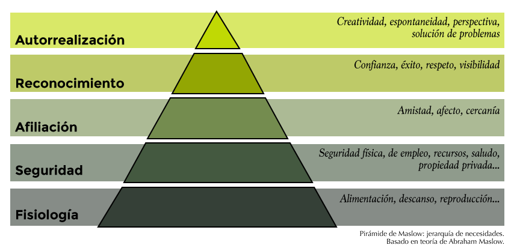

#Necesidades para la construcción de preguntas convocantes
La primera vez que asistí a una formación de [Art of Hosting](http://www.artofhosting.org/es/que-es/)  tuve la oportunidad de compartir con otros *facilitadores* de una experiencia maravillosa que apenas puedo describir: nuevos paradigmas sobre el poder del aprendizaje colectivo y la necesidad de tener conversaciones poderosas. Claro que hubo muchas más cosas que me transformaron pero estas vienen al caso: detrás de un problema hay una pregunta y resolverla implica un *llamado*.

El *llamado* es el compendio de emociones que se conectan en la forma de un postulado, una interrogante que *resuena* en nosotros y nos hace pensar que no sólo es posible que una solución aparezca sino que el participar en esa búsqueda es algo que merecemos. No todo tiene ese tono y por eso no es fácil conectarse con labores del tipo se-tiene-que-hacer-porque-así-es a encontrar que lo que vamos a asumir va de la mano de nuestras emociones, alma, mente y otros misterios.

Justo para integrarlo en la metáfora de Pull-Push que se ha empleado para hablar de cómo los usuarios de internet llegan a la información por una fuerza que los *atrae* (pull/halar) en vez de estar impulsados por un mercado que los *induce* (push/empujar). De igual forma, a un problema llega el que se ve halado por el llamado y no empujado. Y si bien hay formas de conducir-invitar, la prueba empírica reposa en las curvas de apropiación que confirman que siempre hay un grupo de personas que se asoman o llegan cuando otras ya se han arrimado antes.

La educación ha visto lo que implica empujar y no atraer: aprendices con cicatrices de tantas caídas buscando un poco de eco en su camino, agotados de la poca resonancia con su propia voz. Para el caso colombiano pocos textos son tan explícitos como los del bailarín y fundador del Colegio del Cuerpo, Álvaro Restrepo, quien expuso en el diario El Espectador su visión de una educación que "[no sirve para nada](http://www.elespectador.com/noticias/cultura/la-educacion-no-sirve-para-nada-articulo-691752)". Educaciones forzadas, empujadas, lejanas de un llamado que convoque.

Y soy consciente de que no todo se puede convertir en una invitación, que no todo lo que hacemos llega por un *llamado* y que estas afirmaciones no son una declaración que niegue el rigor, la disciplina, el trabajo y el esfuerzo que trae a veces el aprender algo que no sentimos cercano. La resiliencia sabe encontrar su camino. Sin embargo, los problemas se abordan distinto cuando los asumen grupos que están motivados desde un lugar distinto, interno, que brota con una componente intrínseco.

##Motivación
Sobre la motivación humana se sigue estudiando a diario y nuevas publicaciones dan luces sobre lo que mueve a las personas a actuar. Últimamente hay una tendencia de señalar a las nuevas generaciones como motivadas de una forma distinta o que al ser un grupo que ha crecido en condiciones distintas se ve motivado de maneras que leemos como negativas, erradas o producto de fallas en la crianza. Situación que sólo dispara sentimientos de separación y segregación y amplifica ideas sobre si la motivación se nace con ella o se puede construir. Como con casi todos los temas que no comprendemos y generan incertidumbre el camino a los extremos y el maniqueismo es el más rápido.

En el siglo pasado, en 1943, el psicólogo Abraham Maslow publicó un estudio que luego fue interpretado o representado por otros en la forma de una pirámide donde se organizaban las necesidades básicas del ser humano:

