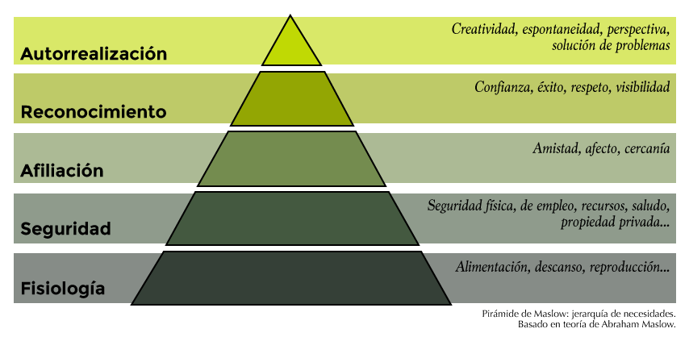

#Necesidades para la construcción de preguntas convocantes

La primera vez que asistí a una formación de [Art of Hosting](http://www.artofhosting.org/es/que-es/)  tuve la oportunidad de compartir con otros *facilitadores* de una experiencia maravillosa que apenas puedo describir: nuevos paradigmas sobre el poder del aprendizaje colectivo y la necesidad de tener conversaciones poderosas. Claro que hubo muchas más cosas que me transformaron pero estas vienen al caso: detrás de un problema hay una pregunta y resolverla implica un *llamado*.

El *llamado* es el compendio de emociones que se conectan en la forma de un postulado, una interrogante que *resuena* en nosotros y nos hace pensar que no sólo es posible que una solución aparezca sino que el participar en esa búsqueda es algo que merecemos. No todo tiene ese tono y por eso no es fácil conectarse con labores del tipo se-tiene-que-hacer-porque-así-es a encontrar que lo que vamos a asumir va de la mano de nuestras emociones, alma, mente y otros misterios.

Justo para integrarlo en la metáfora de Pull-Push que se ha empleado para hablar de cómo los usuarios de internet llegan a la información por una fuerza que los *atrae* (pull/halar) en vez de estar impulsados por un mercado que los *induce* (push/empujar). De igual forma, a un problema llega el que se ve halado por el llamado y no empujado. Y si bien hay formas de conducir-invitar, la prueba empírica reposa en las curvas de apropiación que confirman que siempre hay un grupo de personas que se asoman o llegan cuando otras ya se han arrimado antes.

La educación ha visto lo que implica empujar y no atraer: aprendices con cicatrices de tantas caídas buscando un poco de eco en su camino, agotados de la poca resonancia con su propia voz. Para el caso colombiano pocos textos son tan explícitos como los del bailarín y fundador del Colegio del Cuerpo, Álvaro Restrepo, quien expuso en el diario El Espectador su visión de una educación que "[no sirve para nada](http://www.elespectador.com/noticias/cultura/la-educacion-no-sirve-para-nada-articulo-691752)". Educaciones forzadas, empujadas, lejanas de un llamado que convoque.

Y soy consciente de que no todo se puede convertir en una invitación, que no todo lo que hacemos llega por un *llamado* y que estas afirmaciones no son una declaración que niegue el rigor, la disciplina, el trabajo y el esfuerzo que trae a veces el aprender algo que no sentimos cercano. La resiliencia sabe encontrar su camino. Sin embargo, los problemas se abordan distinto cuando los asumen grupos que están motivados desde un lugar distinto, interno, que brota con una componente intrínseco.

##Motivación
Sobre la motivación humana se sigue estudiando a diario y nuevas publicaciones dan luces sobre lo que mueve a las personas a actuar. Últimamente hay una tendencia de señalar a las nuevas generaciones como motivadas de una forma distinta o que al ser un grupo que ha crecido en condiciones distintas se ve motivado de maneras que leemos como negativas, erradas o producto de fallas en la crianza. Situación que sólo dispara sentimientos de separación y segregación y amplifica ideas sobre si la motivación se nace con ella o se puede construir. Como con casi todos los temas que no comprendemos y generan incertidumbre el camino a los extremos y el maniqueismo es el más rápido.

En el siglo pasado, en 1943, el psicólogo Abraham Maslow publicó un estudio que luego fue interpretado o representado por otros en la forma de una pirámide donde se organizaban las necesidades básicas del ser humano:

Un listado que se puede interpretar como una lectura atenta de las fuerzas interiores que nos llevan a hacer, a buscar, a tomar, a actuar. Y que en el tejido social va de la mano de los deberes de Estados, los derechos de ciudadanos y lo que contemplamos como las condiciones mínimas que necesitamos los seres humanos. Sobre las ideas asociadas a esa pirámide se han diseñado soluciones y productos y ha sido revisado por otros en distintos momentos.

Steven Reiss[^fn-1] presentó al inicio del milenio una teoría de 16 deseos básicos: Poder, independencia, curiosidad, aceptación, orden, ahorrar, honrar, idealismo, contacto social, familia, estatus, venganza, romance, alimentación, actividad física y tranquilidad; deseos que buscamos resolver y que nos dirigen a un estado de motivación constante.

Daniel Pink[^fn-2] por su lado cree que no son deseos sino fuerzas que conducen o dirigen nuestro foco, porque lo que queremos alcanzar es: autonomía, maestría y propósito. Una *verdad sorprendente* como el mismo lo describe y que sin ser reduccionista nos permite contemplar grandes acciones a partir de 3 términos cercanos. Lo que Pink desató fue la recuperación para occidente del concepto de mejora constante, de un buscar un estado de autolectura crítica para encontrar qué nos motiva.

Y casi que en el otro extremo, en el Sur, en una misteriosa metáfora de los nuevos nortes que se asoman en las periferias, Manfred Max-Neef, Antonio Elizalde y Martin Hopenhayn[^fn-3] no hablan de motivaciones intrínsecas, necesidades o fuerzas que conducen sino de "preferencias reveladas" como si de velos que vamos levantando, de ventanas que nos muestran nuestra lectura del mundo se tratara. Los autores proponen una matriz que se construye en un eje con "categorías existenciales" : *ser, tener, hacer* y *estar*, contra otro eje de "categorías axiológicas" o elecciones humanas para comprender el valor moral, una postura ética, elecciones estéticas, etc. armado por: subsistencia, protección, afecto, entendimiento, participación, ocio, creación, identidad y libertad. Al encontrase un eje contra el otro se revelan las preferencias.

Al ser la motivación intrínseca un movilizador tan fuerte, tiene sentido que se convierta en un eje sobre el que se arman propuestas para mejorar ambientes de trabajo como lo sugiere Jurgen Apelo[^fn-4] con sus CHAMPFROGS o las siglas en Inglés para hablar de: Curiosidad, honor, aceptación, maestría, estatus, poder, libertad, metas, relaciones y orden. Apelo lo transforma en un actividad en la forma de un juego de cartas que puede liberar conversaciones poderosas desde el liderazgo y con equipos de trabajo: cruzar palabras que hablen de lo que realmente nos motiva en un momento de nuestras vidas porque puede ser temporal.

Es probable que se me queden por fuera otras iniciativas y teorías sobre la motivación de grupos, de equipos, de individuos y líderes y estarán en nuevas versiones de este texto iterativo cuando me cruce con ellas. Pero para la construcción de la propuesta sobre agilidad en la educación desde la formulación de preguntas convocantes que apunten a la solución de problemas, veo necesario profundizar, adentrarnos un poco más y recorrer las investigaciones de neurología y sus hallazgos a la fecha en motivación y cerebro y psicología social. En ese frente, David Rock[^fn-5] ha construido un juicioso resumen a partir de entrevistas y tejido un modelo propio con las siglas SCARF.

Lo interesante de esa "bufanda" de Rock es que se refiere a unos gatillos, una forma de detonantes que activan las alarmas del cerebro cuando hay información que se pone en riesgo o satisface: estatus, certeza, autonomía, relaciones sociales, y el sentido de justicia. Cinco (5) conceptos que vemos como expresiones que generan sentido y que para el cerebro son motivo de atención y reacción. Cuando alguna de ellas se percibe como impactada, la relación, el diálogo, la comprensión misma de una situación cambia y se convierte en un giro negativo o una oportunidad. 

##Problemas como oportunidades

Heurística 1: Un problema es una *asociación* que hace el cerebro entre una situación y los riesgos a su estatus, certeza, autonomía, relaciones sociales, o sentido de justicia.

No es una hipótesis, es una **heurística** o una forma de procurar una respuesta o una solución a partir de una sugerencia y que nos permita organizar los materiales necesarios para la construcción de un experimento. Y en este caso, es darle un cuerpo a los problemas de tal forma que podamos identificar las preguntas poderosas, convocantes, que motiven a un grupo, desde llamados internos que hagan sostenible la búsqueda de una solución. Resolver exige dedicación, convergencia, divergencia, caos, foco y eso se asoma cuando una fuerza interior nos motiva.

| Tema  | Estatus | Certeza | Autonomía | Relaciones sociales | Sentido de Justicia |
| ------ | ------ | ------ | ------ | ------ | ------ |
| Situación complicada que merece atención | ¿Cómo me impacta desde el estatus? Afecta la forma en que me perciben; el cómo me percibo yo mismo; la idea de pertenencia a un círculo a un grupo se ve modificada... | ¿Me preocupa tanto el no saber qué va a pasar? Necesito tener información que me "asegure" o por lo menos me de un poco de tranquilidad | ¿Pierdo la libertad que he logrado por esta situación? Mi movilidad se ve reducida por que no tengo amigos, no entiendo el lenguaje, no conozco a nadie, mi círculo de apoyo está lejos, etc. | ¿Los lazos que he establecido hasta ahora desaparecen? Cómo construir un nuevo tejido social; qué implica estar solo, etc. | ¿Esto me pasa sólo a mi? |
[Matriz de Pregunta activada][section-mmd-tables-table1] 

##Matriz de Pregunta Activada (MaPA)

Este "MaPA" no muestra una ruta o un destino, tampoco sugiere la ruta para seguir, y permite que desde un punto elevado veamos los impactos que tienen un grupo de personas o un individuo a un nivel básico, basados en el Modelo SCARF de David Rock. El giro que le doy es sumar la temática y usarlo para el diseño de situaciones que nos permitan entrar en procesos de conexión y empatía. No es fácil sentir lo que otro siente y por eso representamos la fuente de esa emoción señalando lo que podría activar en la mente.

Si sabemos que un grupo o una persona tiene una fricción natural con la noción de **justicia** podemos hacer énfasis en ese cruce del tema/situación o fuente del problema, y dar inicio a la construcción de nuestras propias apuestas de cómo se va a abordar, para que la *pregunta activadora* convoque, llame y resuene con el usuario. La pregunta es el pivote que la da sentido a nuestras acciones, al esfuerzo, a la frustración que traen las fallas que no pueden faltar y que se conviertan en lecciones y aprendizajes.

Juan Daza Arévalo [@juanenlasala](http://twitter.com/juanenlasala)
Agile Based Learning | Aprendizaje Basado en Agilidad: [Meetup](https://www.meetup.com/Agile-Based-Learning-Aprendizaje-Basado-en-Agilidad/) | [Git](http://belarga.github.io/aprendizaje-basado-en-agilidad)

###Referencias

[^fn-1]: Reiss, Steven. (2002). *Who am I?: 16 Basic Desires that Motivate Our Actions Define Our Personalities*. Berkley. EE.UU.
[^fn-2]: Pink, Daniel. (2010). *Drive: The Surprising Truth About What Motivates Us*. Canongate Books. EE.UU.
[^fn-3]: Max-Neef, Manfred, Elizalde, Antonio y Hopenhayn, Martin. (1989). *Human Scale Development Conception Application and Further Reflections*. Apex PR. EE.UU. 
[^fn-4]: Apelo, Jurgen. (2011). *Management 3.0: Leading Agile Developers, Developing Agile Leaders* (Addison-Wesley Signature Series (Cohn)). EE.UU. 
[^fn-5]: Rock, David. (2009). *Your Brain at Work: Strategies for Overcoming Distraction, Regaining Focus, and Working Smarter All Day Long*. Haper Collins, EE.UU.
